# CoffeeTrace - A Supply Chain Management dApp

- An Ethereum Network based decentralized application
- [CoffeeTrace dApp Presentation](https://drive.google.com/file/d/0B-L_poh5q6-CTzJkdFdEYU1yN2pEYTJoZF9RNVBjSmgtbTA0/view?usp=sharing)

### **Developer Details:**

**_Name:_** _Muzammil_ <br>
**_Student Id:_** 101281406

# Description

This is an Ethereum DApp that demonstrates a Coffee Supply Chain System. The user story is similar to any commonly used supply chain process. A Seller can add items to the inventory system stored in the blockchain. A Buyer can purchase such items from the inventory system. Additionally a Seller can mark an item as Shipped, and similarly a Buyer can mark an item as Received.

## Problem

Coffee is considered as the second largest traded commodity in the world with a market share of over $100 billion.  As the demand from the consumers continue to increase daily all over the world,  the Traditional Coffee Supply Chain Systems still face many challenges. Here are some of those listed:

- Time and Cost
  - Current lifecycle is complex and time-consuming
  - Contracts managed by middlemen
- Traceability 
  - Difficulty in tracking the defects and authenticity
- Transparency
  - several relationships between parties such as farmers, distributors, retailers and consumers increase the friction
  - Decreases the trust and transparency
- Redundancy
  - all parties have their own inventories and transactions stored

## Solution - Why CoffeeTrace?

- Blockchain based Supply Chain System
- Based on Ethereum Network
  - Well supported and Developed Network
- Shared Visibility and Shared State - all entities have same version of ledger.
- Increases trust between the parties and end consumers
- Easily sold/bought/exported with a record on blockchain to verify authenticity
- Use of Smart Contracts - increases the efficiency and time management

### Benefits

- Increase speed and transparency for all transactions through real time access to events
- Reduced cost and increased efficiency through paperless process
- Instant access towards end-to-end traceability data 
  - to verify history and quality of the coffee supply chain network
  - to track the progress from the initial state to delivery
- Immutable transactions
  - inventory records, storage conditions, delivery times and dates cannot be falsified
- Transfer of payments with ease; in a faster way

### *CoffeeTrace Architectural Sequence Diagram for current version dApp*
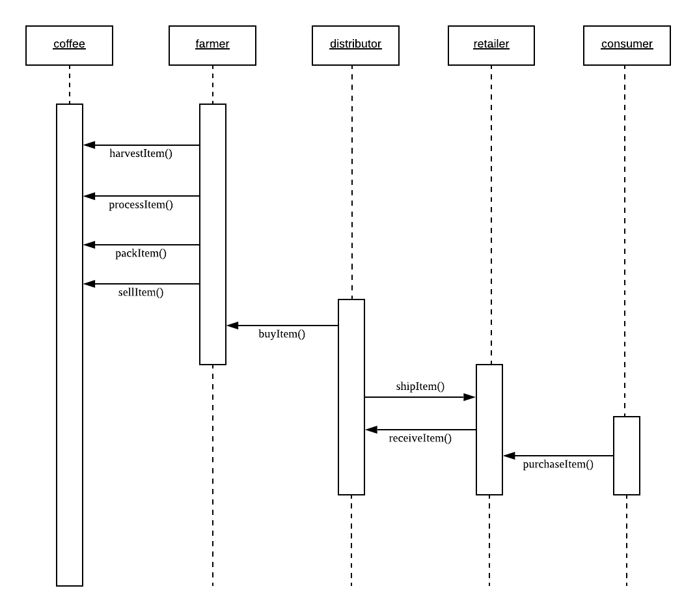

### *CoffeeTrace Architectural Class Diagram for current version dApp*
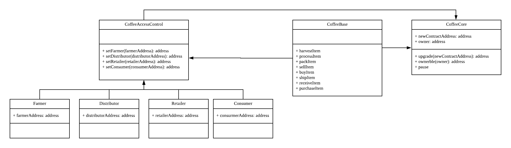

# Vision/Implementation

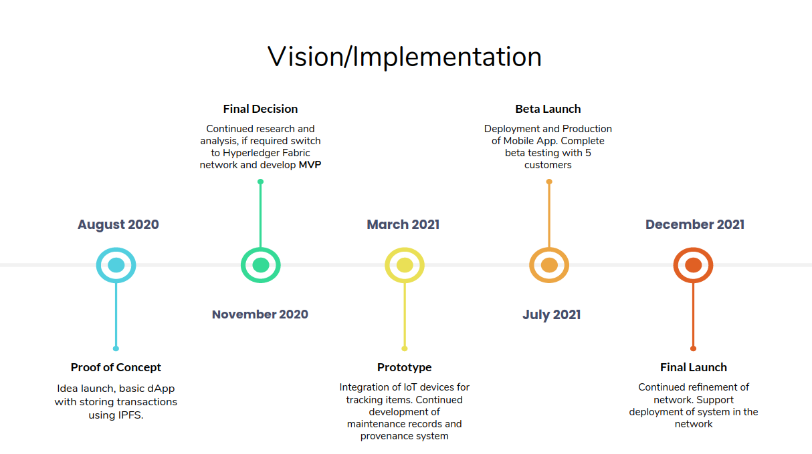

# Software Used

1. npm (package installation + react server starting)
2. truffle + ganache (local ethereum network)
3. JS, HTML, CSS (front end framework)
4. web3 (connections to Metamask + ethereum network)
5. Metamask (connection point to ethereum node)
6. Remix (optional - web IDE that can connect and view deployed contract status)

The DApp User Interface when running should look like...

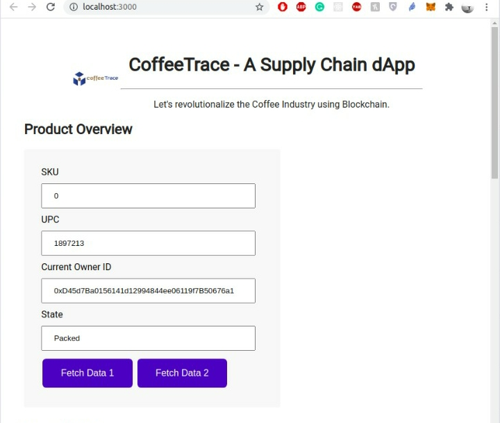

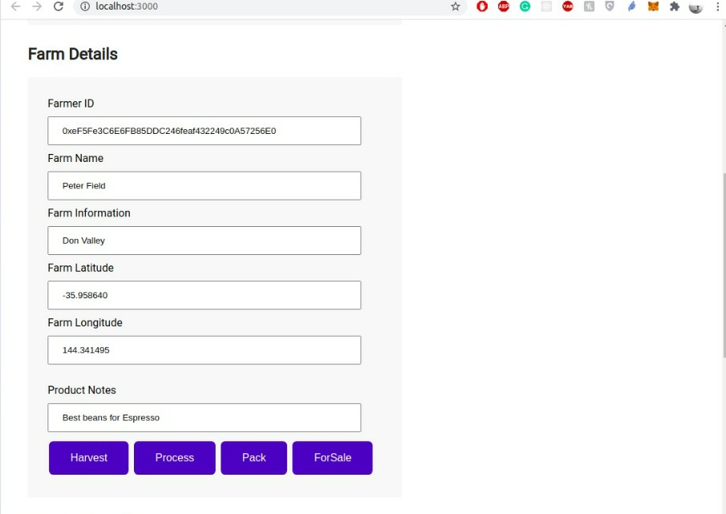

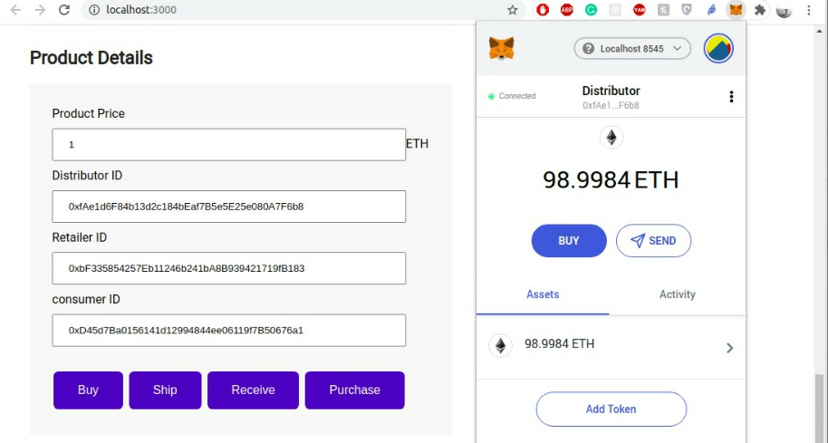

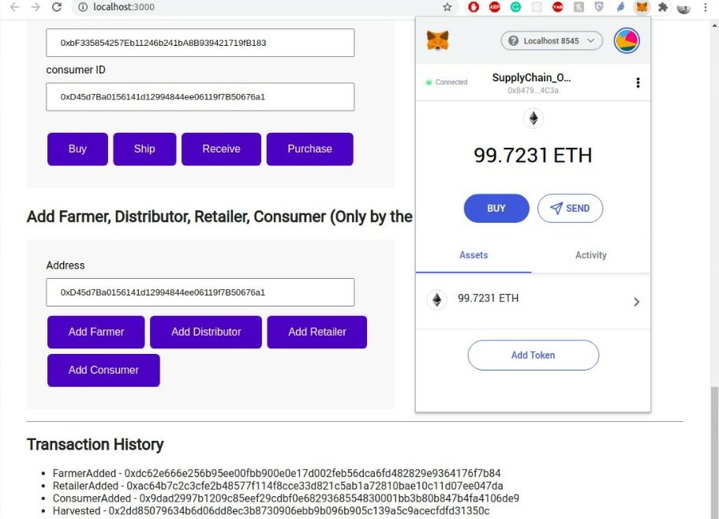

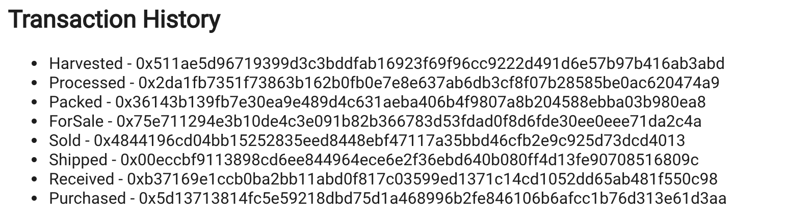


## Getting Started

These instructions will get you a copy of the project up and running on your local machine for development and testing purposes. See deployment for notes on how to deploy the project on a live system.

### Prerequisites

Please make sure you've already installed ganache-cli, Truffle and enabled MetaMask extension in your browser.


### Installing

A step by step series of examples that tells you how to get a development environment running

Clone this repository:

```
git clone https://github.com/muzz56/coffeeTrace
```

Change directory to ```dApp``` folder and install all pre-requisite npm packages (as listed in ```package.json```):

```
cd dApp
npm install
```

Launch Ganache:

```
ganache-cli -m "outside frog empty glue slim eternal dune behind limit jewel plate cloud"
```

Your terminal should look something like this:

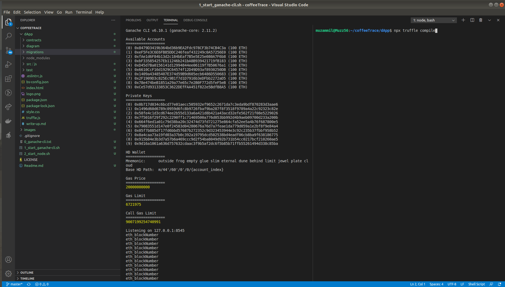

In a separate terminal window, Compile smart contracts:

```
truffle compile
```

Your terminal should look something like this:

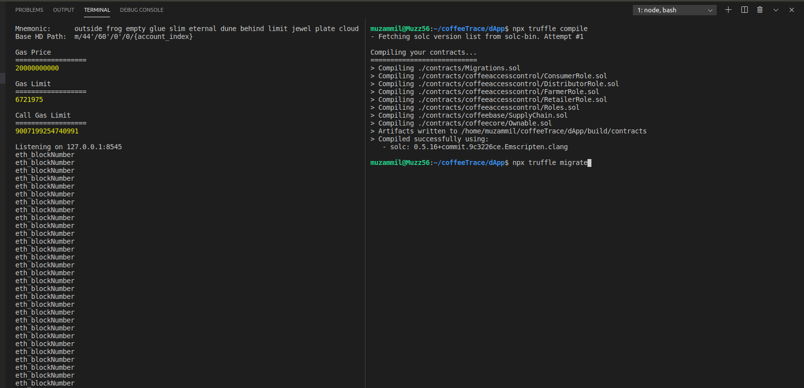

This will create the smart contract artifacts in folder ```build\contracts```.

Migrate smart contracts to the locally running blockchain, ganache-cli:

```
truffle migrate
```

Your terminal should look something like this:

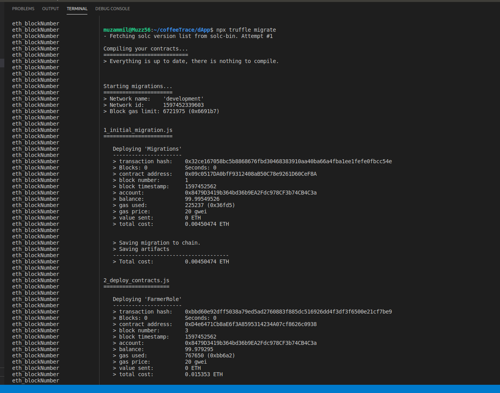

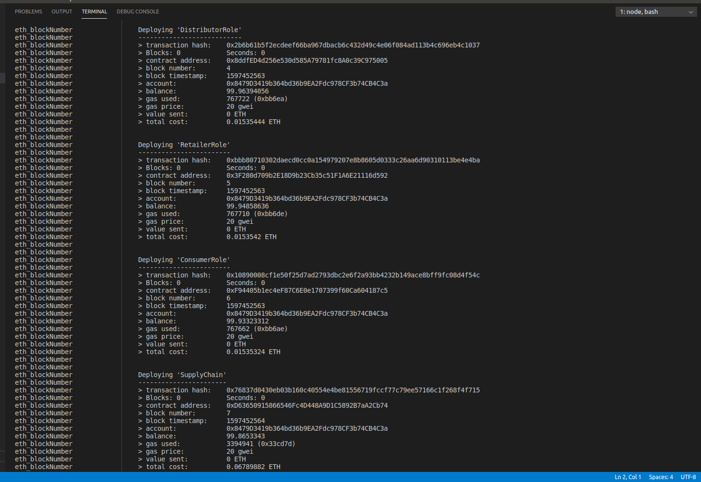

Testing Smart Contracts:

```
truffle test
```

All 14 tests should pass.

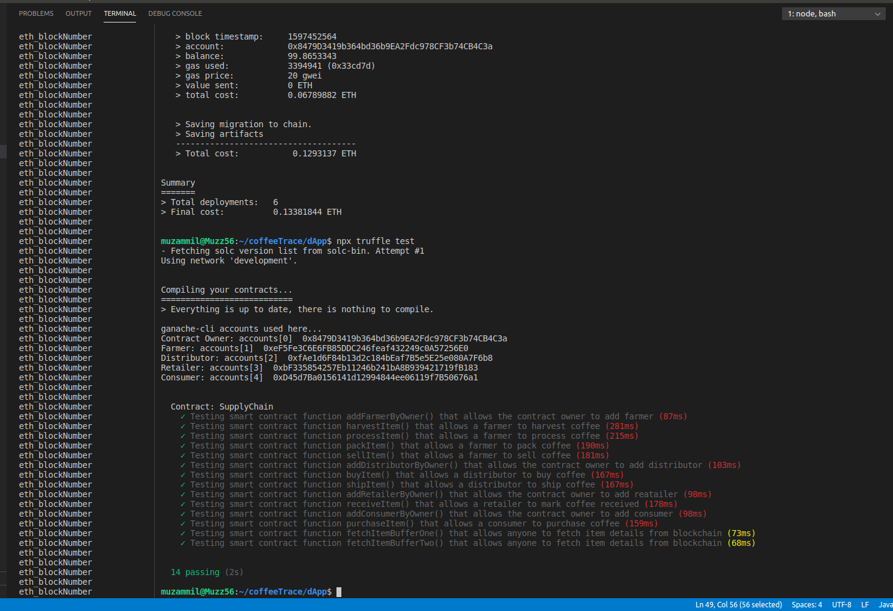

In a separate terminal window, launch the DApp:

```
npm run dev
```

#### Import Accounts into MetaMask:
the folowing ganache-cli accounts should be imported into MetaMask:
```
ganache-cli accounts used here...
ContractOwner: accounts[0] 0x8479D3419b364bd36b9EA2Fdc978CF3b74CB4C3a
Farmer:        accounts[1] 0xeF5Fe3C6E6FB85DDC246feaf432249c0A57256E0
Distributor:   accounts[2] 0xfAe1d6F84b13d2c184bEaf7B5e5E25e080A7F6b8
Retailer:      accounts[3] 0xbF335854257Eb11246b241bA8B939421719fB183
Consumer:      accounts[4] 0xD45d7Ba0156141d12994844ee06119f7B50676a1
```
#### Select Contract Owner Account in MetaMask:

#### Add Farmer :
Add all actors into Contract:
*   Add Farmer
*   Add Distributor
*   Add Retailer
*   Add Consumer

#### Select Farmer Account on MetaMask:

#### Activate Farmer Actions in following order:
*   Harvest
*   Process
*   Pack
*   For Sale

#### Select Distributor Account on MetaMask:
Activate Distributor Actions in following order:
*   Buy
*   Ship

#### Select Retailer Account on MetaMask:
Activate Retailer Actions in following order:
*   Receive

#### Select Consumer Account on MetaMask:
Activate Consumer Actions in following order:
*   Purchase

## Built With

* [Ethereum](https://www.ethereum.org/) - Ethereum is a decentralized platform that runs Smart Contracts
* [IPFS](https://ipfs.io/) - IPFS is the Distributed Web | A peer-to-peer hypermedia protocol
to make the web faster, safer, and more open.
* [Truffle Framework](http://truffleframework.com/) - Truffle is the most popular development framework for Ethereum with a mission to make your life a whole lot easier.
* [Ganache](https://www.trufflesuite.com/ganache) - Ganache is a personal Blockchain. You can use Ganache across the entire development cycle; enabling you to develop, deploy, and test your dApps in a safe and deterministic environment.

## Authors

* [Muzammil](https://www.linkedin.com/in/muzammil-853551103/)

## Acknowledgments

* Solidity
* Ganache-cli
* Truffle
* IPFS
